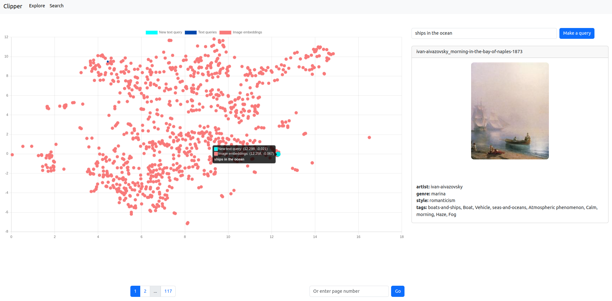
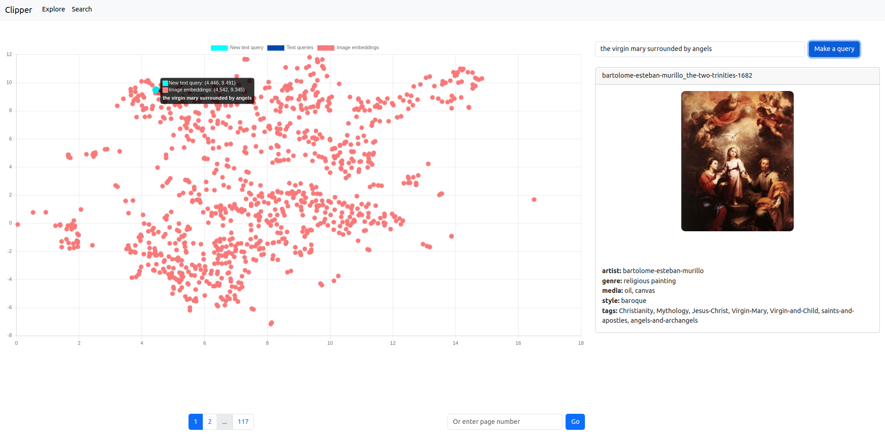
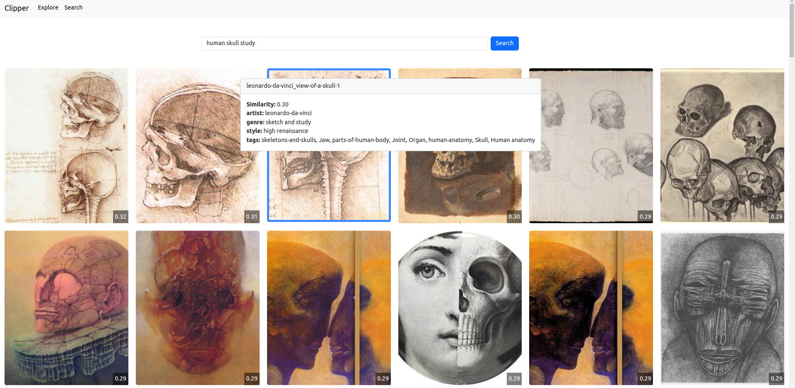

# Clipper: CLIP Embeddings Visualizer for Computer Vision Datasets

Clipper is a web application that allows you to visualize the CLIP embeddings of the images in your computer vision dataset.



## Features

* 2d-visualization of the CLIP embeddings of your image dataset, after dimensionality reduction with UMAP.
* 2d-projection of text queries to find images that are semantically similar to the query.

* Semantic search of images in your dataset using text queries.


## Background

[CLIP (Contrastive Language-Image Pre-training)](https://arxiv.org/abs/2103.00020) is a neural network trained on a variety of (image, text) pairs, using constrastive learning. It is able to map images and text to a common embedding space, such that semantically similar images and text are close to each other in the embedding space. CLIP is trained on a large dataset of images and text, and is able to generalize to new images and text.

## Tech Stack

* [Flask](https://flask.palletsprojects.com/en/2.0.x/) - Python web framework
* [Vue.js](https://vuejs.org/) - Javascript framework
* [ChromaDB](https://docs.trychroma.com/getting-started) - Vector database
* [UMAP](https://umap-learn.readthedocs.io/en/latest/) - Dimensionality reduction
* [HuggingFace's Transformers](https://huggingface.co/transformers/) - Neural network models

## Installation

Clone the repository.
```bash
git clone https://github.com/nicolafan/clipper.git
```

### Backend

1. Create a virtual environment.
    ```bash
    python3 -m venv venv
    ```
2. Activate the virtual environment.
    ```bash
    source venv/bin/activate
    ```
3. Install the required Python packages.
    ```bash
    pip install -r requirements.txt
    ```

### Frontend

1. Navigate to the frontend directory.
    ```bash
    cd clipper-frontend
    ```
2. Install the required Node.js packages.
    ```bash
    npm install
    ```

## Usage

Clipper requires a dataset of `.jpg` images. The images have to be stored in the `data/images` directory. If you have metadata attached to the images, you can store it in a JSON file with the following format:

```json
{
    "image_id_1": {
        "metadata_key_1": "metadata_value_1",
        "metadata_key_2": "metadata_value_2",
        ...
    },
    "image_id_2": {
        "metadata_key_1": "metadata_value_1",
        "metadata_key_2": "metadata_value_2",
        ...
    },
    ...
}
```

where `image_id_1`, `image_id_2`, etc. are the filenames of the images without the `.jpg` extension. Supported metadata types are declared in the ChromaDB documentation. The JSON file has to be stored in the `data/images` directory.

### Creating the Embeddings

To create the embeddings of the images in your dataset, and store them in ChromaDB, run the following command:

```bash
python3 clipper/process/clippify.py
```

The embeddings are created by passing the images through CLIP, and storing the output of the last layer of the CLIP model. The embeddings are stored in ChromaDB, along with the metadata of the images. The script will possibly use your GPU to speed up the process.

### Reducing the Dimensionality of the Embeddings

To reduce the dimensionality of the embeddings, run the following command:

```bash
python3 clipper/process/dimred.py
```

The script will use UMAP to reduce the dimensionality of the embeddings from 512 to 2 for visualization. The reduced embeddings are stored in ChromaDB.

UMAP has been chosen because of the possibility to define a custom distance function. The distance function used is the cosine distance between the embeddings. In particular, the cosine distance between a text embedding and an image embedding has to be multiplied by a factor of 2.5, to account for the different representation of the text and image embeddings. The factor has been chosen according to the results presented in the [CLIPScore paper](https://arxiv.org/abs/2104.08718).

Once the dimensionality reduction is complete, you can start the backend and frontend servers.

### Backend

1. Activate the virtual environment.
    ```bash
    source venv/bin/activate
    ```
2. Enter the API directory.
    ```bash
    cd clipper/api
    ```
3. Run the Flask server.
    ```bash
    flask run
    ```

### Frontend

1. Navigate to the frontend directory.
    ```bash
    cd clipper-frontend
    ```
2. Run the Vue.js server.
    ```bash
    npm run serve
    ```

## Contributing

Contributions are what make the open source community such an amazing place to learn, inspire, and create. Any contributions you make are greatly appreciated!

Clipper is still in its early stages, and there are many features that can be added!

Please, open an issue if you have any questions or suggestions.

Pull requests are welcome. For major changes, please open an issue first
to discuss what you would like to change.

## References

* [Learning Transferable Visual Models From Natural Language Supervision](https://arxiv.org/abs/2103.00020)
* [CLIPScore: A Reference-free Evaluation Metric for Image Captioning](https://arxiv.org/abs/2104.08718)

## License

[MIT](https://choosealicense.com/licenses/mit/)